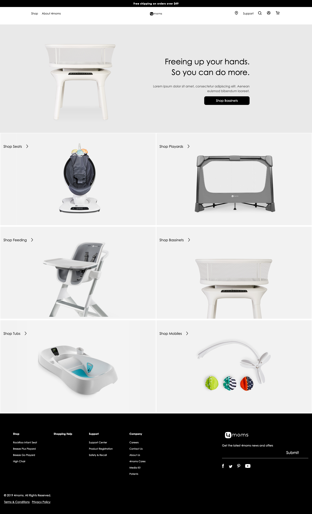

# Dev Test Walkthrough Details

For the development test, the following are presented for review: 

1. **User stories** for insight into project segmentation methodology 
1. **Supporting files** for project rendering and review
1. **Code** included in this repository

# User Stories

1. Visit https://www.atlassian.com/
1. Authenticate
1. Visit https://devtest2021.atlassian.net/jira/software/projects/DEVTEST/boards/1/backlog


# Supporting Files and Setup
_Note:_ .gitignore is a generic file.

```
├─ .gitignore
├─ gulpfile.js
├─ package.json
├─ README.md
```


## Setup
1. Clone repository
1. Run ``` npm install ```
1. Run ``` gulp sync ```
1. Access [http://localhost:3000](http://localhost:3000)


# Code Walkthrough

## Markup / Structure

CSS is split into three broad categories
1. Critical CSS
1. CDN Libraries
1. Custom Styling

## Critical CSS
Loaded quickly due to intial retreival with the page HTML, critical CSS allows for rapid formatting of 'above the fold' content. 

## CDN Libraries
Utilization of 3rd-party hosted files leverages commonly utilized libraries that have a high likelihood of already residing in the user's cache, lower overall page load times. 

## Custom Styling
Allows for complex styles to be rendered after core content and styles have been rendered, reducing perceived load times for users. External Century Gothic webfont loaded from CDN. 

## SCSS/CSS
Mobile-first design based on comps. Single media query provided for responsiveness. Additional breakpoints would be added as deemed necessary for mobile, tablet, large display, etc.
``` 
@media (min-width: 750px) 
```

## JS Functions

*Note:* Google CDN utilized for leveraging likelihood of the user having the required assets already stored in cache. 

### Menu Dropdown Functionality 
Code Ref: ``` Enable dropdown menu ```

Menu dropdown functionality based on tapping / clicking the menu icon

### Menu Link  
Code Ref: ``` Enable menu highlight on link hover ```

Provides cateogry text and image highlights on hover for users. Content is included in markup via 'data-' tags for ease of editing for developers. 
``` 
<li>
	<a href="#" 
		data-img="images/category_feeding.jpg"
		data-copy="High Tech Baby Products...">
			Shop All
	</a>
</li> 
```

## Menu Cateogry Background Images 
Code Ref: ``` Footer mobile menu display toggle ```

A mobile-first implementation of the menu accorians exhibited through a default closed state (via CSS) to prevent jitter from closing of menus by JS after load if the user already scrolled. 

```
<div class="footer_menu">
	<div class="footer_menu_title inactive" data-footer_menu_title="shop">
		Shop
	</div>
	<div class="footer_menu_links" data-footer_menu_links="shop">
		<a href="#">RockRoo Infant Seat</a>
		<a href="#">Breeze Plus Playard</a>
		<a href="#">Breeze Go Playard</a>
		<a href="#">High Chair</a>
	</div>
</div>
```


### Cateogry Section Background Images 
Code Ref: ``` Category background images ``` 

Instead of including images as CSS backgrounds in a separate file, this function permits separation of concerns and ease of editing by developers through utilization of a ```data-``` tag within the markup. 


# Screenshots




